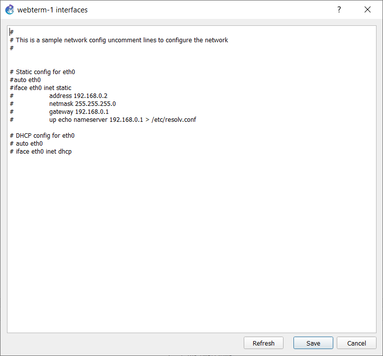
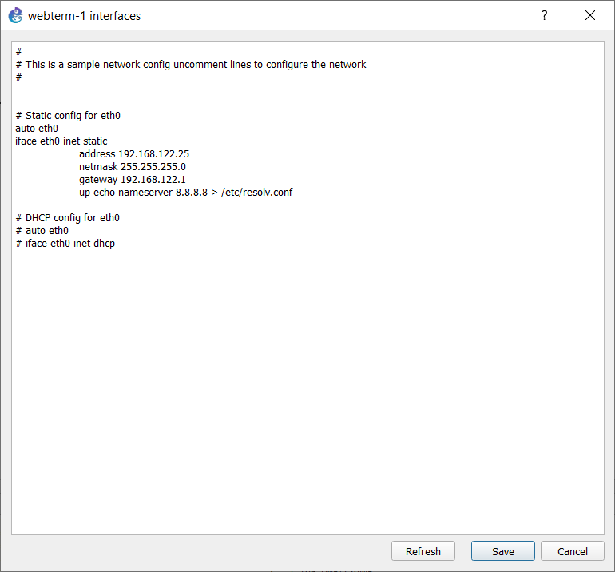
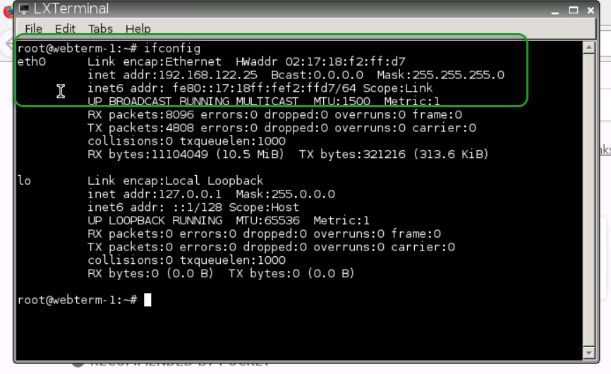
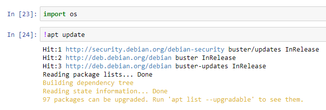

# Лабораторная работа №
В лабораторной работе рассмотрены основы передачи данных с использованием стека TCP/IP и сокетов в Python
## Начало работы

### Шаг 1 : Начальная конфигурация проекта
Откройте GNS3 клиент, и создайте новый проект
Добавьте в область топологии сети устройства *NAT*, *Jupyter2.7*, *Webterm*, *Ethernet switch* и подключите между собой сетевым кабелем согласно рисунку ниже:


> [!TIP]
> NAT можно заменить на Cloud, тогда устройства получат адреса вида 10.242.188.XXX и будут доступны из браузера компьютера, а не Webterm.


### Шаг 2: Настройка устройств

1.	По умолчанию, в `docker` контейнерах отсутствует присвоение IP-адреса после старта устройства. Для возможности передачи данных через моделируемый сегмент сети необходимо включить технологию динамической конфигурации сетевых интерфейсов на устройствах **Jupyter** и **Webterm** (пункты аналогичны для обоих устройств)
2.	Нажмите ПКМ на устройстве и выберите опцию `Configure`
3.	В открывшемся окне в разделе `Network configuration` выберите `Edit`
4.	Раскоментируйте строки, следующие после `#DHCP config for eth0`



5.	Повторите шаги 2-4 для оставшихся устройств
6.	Запустите все устройства, нажав кнопку  

__________
Примечание: Начиная с GNS3 2.0, стал доступен узел `NAT`. Этот узел позволяет подключать топологию к Интернету через NAT. Интернет-узел устарел в пользу этого узла и облачного узла. Ваша топология не будет напрямую доступна из Интернета или локальной сети при использовании узла `NAT`. Если это необходимо, следует использовать узел `Cloud`. 
__________
По умолчанию на узле NAT работает DHCP-сервер с предопределенным пулом в диапазоне `192.168.122.0/24`. Он находится в категории Конечные устройства:
Вы не ограничены только использованием динамического назначения адресов с узлом `NAT`. Вы также можете статически назначить ему IP-адрес и по-прежнему иметь доступ в Интернет.
__________


Остановите контейнер `Webterm`, щелкните его правой кнопкой мыши и снова выберите `«Изменить конфигурацию»`.
На этот раз вы закомментируете две строки для DHCP и раскомментируете строки в разделе статического IP файла `/etc/network/interfaces`



В приведенном выше примере контейнеру `Webterm` был статически назначен IP-адрес и маска `192.168.122.25/24`, его шлюз по умолчанию был установлен на `192.168.122.1` (внутренний IP-адрес узла `NAT`), а сервер имен был установлен на `8.8. 8.8`, который является одним из бесплатных общедоступных DNS-серверов Google.
Нажмите `«Сохранить»`, запустите контейнер и вернитесь в него консолью. Открытие терминала и запуск `ifconfig` покажет, что контейнер использует статически назначенный IP-адрес:



При вводе URL-адреса в адресной строке `Firefox` откроется веб-сайт:


### Шаг 3: Передача данных через утилиту `netcat`
Нажмите ПКМ на соединении между одним из устройств `Webterm` и коммутатором, выберите пункт `Start Capture`


В открывшемся окне подтвердите выбор соединения для захвата пакетов, это инициирует запуск программного продукту `Wireshark`, который будет перехватывать все сетевые пакеты на данном соединении для их дальнейшего анализа.


Как видно из рисунка, `Wireshark` уже начал захват пакетов, но пока в сети передаются только служебные сообщения от коммутатора, а именно, сообщения протокола `STP`, необходимого для  устранения петлевых соединений между коммутаторами.

Перейдите в консоль `Webterm-1`, по умолчанию, откроется графическое окно с интерфейсом веб-бразера, но снизу вы можете заметить кнопку-аналог меню «Пуск» для ОС Windows; нажмите на нее и выберите Terminal. Выполните команду `ip address` или `ifconfig` для того, чтобы вывести на экран текущие параметры сетевого адреса устройства. Проделайте это действие для другого устройства `webterm` и запишите их адреса.
По умолчанию в используемых контейнерах отсутствует утилита `netcat` и `nc`. Установить ее можно выполнив в терминале команду `apt update && apt install netcat –y`
После установки пакета netcat выполните в терминале `webterm-1` команду `nc -l -p 20000` Это запустит утилиту `nc` в пассивном режиме (флаг -l), указав для прослушивания номер порта более 20000. Теперь этот контейнер выполняет функцию сервера и прослушивает входящие соединения на порт 20000 любого из подключенных к нему сетевых интерфейсов, в том числе виртуальных.
В терминале `webterm-2` повторите установку пакета `netcat` и выполните команду `nc IP - address 20000`, где `IP-address`– сетевой адрес контейнера webterm-1.
После установления соединения, текст, набранный в терминале `webterm-2`, по нажатию клавиши Enter будет пересылаться на `webterm-1` и отображаться в терминальном окне. Убедиться в этом, передав по установленному соединению несколько произвольных осмысленных фраз. После этого завершить соединение, нажав комбинацию `Ctrl + C`.
__________
Остановите захват пакетов в анализаторе протоколов `Wireshark`. Приведите в отчете информацию о захваченных Wireshark пакетах, какие команды установления соединения использовались при передачи данных?
___________
С помощью команды `netcat` можно передать часть текстового файла или произвольное сообщение, одно из наиболее применяемых решений комбинирования команд выглядит следующим образом:
```
echo “message” | netcat –t ip-address port
```
> [!WARNING]  
> Github ломает одинарные и двойные кавычки, команду лучше перепечатать руками.

, где в качестве аргументов подставляются сетевой адрес и порт устройства-сервера (например: `echo “hello” | netcat –t 192.168.122.12 20000`)
## Передача данных между устройствами Jupyter2.7
1.	Откройте в веб-браузере новую страницу и перейдите по адресу, соответствующему устройству Jupyter2,7-1 в окне Topology Summary (например: `http://95.143.222.94:5018`)
2.	Нажмите кнопку `New` для добавления нового файла и выберите тип файла `Python2`
3.	Для передачи данных в `jupyter` на этом этапе работ будем использовать ту же утилиту `netcat`, но поскольку в указанном контейнере отсутствует возможность напрямую взаимодействовать с командной строкой Linux, то необходимо импортировать библиотеку, отвечающую за выполнение системных вызовов: 
```
import os
```


4.	Jupyter может передавать команды в консоль прямо из графического веб интерфейса, для этого нужно использовать служебный символ «!» перед командой. Обновим список репозиториев выполнив команду `!apt update`



5.	Установите пакет `netcat` выполнив команду `!apt install netcat`, обратите внимание, что если вывод команды соответствует изображению ниже, то утилита уже установлена


6.	Узнайте IP-адрес устройства, выполнив команду `!ip address`


7.	Выполните передачу данных используя системный вызов os.system, эта команда передает аргумент в консоль, выполняет эту команду и возвращает код ее завершения: 
```
os.system(“echo ‘message’ | netcat –t 192.168.122.11 20000”)
``` 


> [!WARNING]  
> В примере на ПК с адресом 192.168.122.11 запущен nc в режиме сервера на порте 20000.

> [!TIP]
> На ПК "сервере" можно запустить цикл приема, при котором принимается несколько сообщений подряд.
> В режиме бесконечного цикла запустить сервер netcat можно командой "while true; do nc -l -t 20000; done"

> [!TIP]
> В netcat есть возможность автоматически закрывать сессию, не дожидаясь нажатия "Ctrl+C" на сервере. Для этого при передаче необходимо добавить опцию -w 1 (таймаут соединения 1 секунда). В более старых версиях Netcat работает аргумент -t (принудительное закрытие сессии при появлении символа конца строки EOF). Доступные аргументы для вашей версии Netcat можно узнать выполнив команды "netcat -h" и "nc -h" на клиенте и сервере соответственно.

8.	В случае успешного выполнения команды вы увидите значение 0 в выводе, 256 в случае отклонения пакета сервером (например, сервер не запущен), и значение 32768 при ошибке выполнения из-за неинициализированной переменной (Код завершения команды будет напечатан только после закрытия соединения, то есть закрытия команды nc на части «сервера» нажатием `Сtrl+C`, до этого команда будет бесконечно отправляться)


9.	Используя системные вызовы и оператор «!» напишите команду, отправляющую на «сервер» текущее время и дату вместе с информацией о системе (`uname –a`)
10.	Прикрепите к отчету снимок экрана, показывающий успешный прием на сообщения на устройстве «сервере»
11.	Выполните захват пакета из п.11 в утилите `Wireshark` и прикрепите к отчету снимок экрана, подтверждающий захват этого пакета
По окончании нажмите кнопку  и закройте GNS3. При использовании локального сервера, GNS3 VM закроется автоматически
Вопросы:
1.	Какой функционал предоставляет функция os.system()?
2.	Почему возникает ошибка передачи при выполнении команды netcat с аргументом –t при попытке передать данные без запущенного «сервера»?
